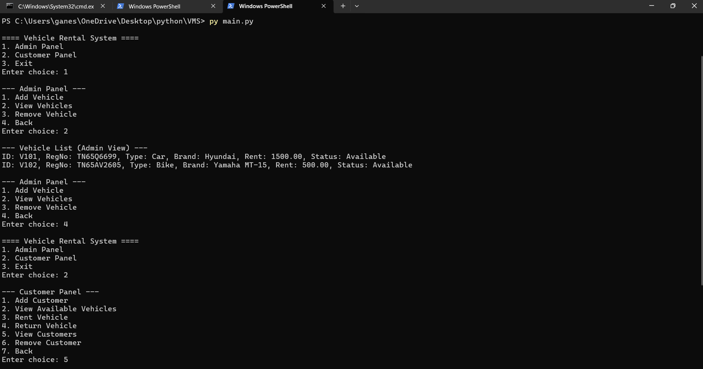

# 🚗 Vehicle Management System (VMS)

A Python-based Vehicle Management System integrated with MySQL database to manage vehicle rentals efficiently.

---

## 📌 Features
- Add and View Vehicles
- Remove Vehicles (Safe Delete)
- Add and View Customers
- Remove Customers (Safe Delete)
- Rent Vehicles
- Return Vehicles
- Track Vehicle Availability

---

## 🛠️ Tech Stack
- Python
- MySQL
- MySQL Connector (Python)

---

## 📂 Project Structure
VMS/
│
├── main.py
├── database.py
├── README.md
├── requirements.txt
│
└── srcc/
├── init.py
├── admin.py
└── customer.py

---

## ⚙️ How to Run

1. Install dependencies:

pip install mysql-connector-python

2. Create database and tables in MySQL.

3. Run the project:

python main.py

---

## Output Screenshot

---

## 🎯 Description
This system allows administrators to manage vehicles and customers, while enabling customers to rent and return vehicles. It uses relational database concepts and ensures data integrity using foreign keys.

---

## 👨‍💻 Author
Ajayvarman M
Python developer
